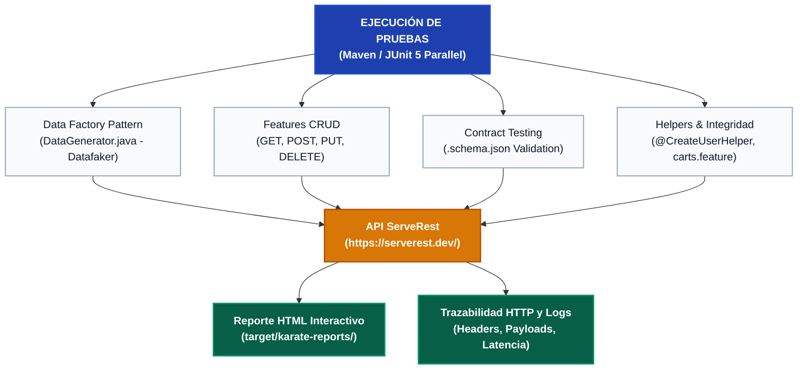

# Informe Técnico: Estrategia de Automatización de APIs y Patrones de Diseño

**Candidato:** Daniel Llontop  
**Proyecto:** Reto de Automatización QA Backend — ServeRest  
**Stack Tecnológico:** Karate DSL (v1.5.2), Java 21, Datafaker, Apache Maven, JUnit 5  
**Entregable:** Informe de Estrategia Técnica y Decisiones de Arquitectura (Entregable 3)

---

## 1. Introducción y Propósito

El presente informe documenta las decisiones técnicas, patrones de arquitectura y estrategias de calidad implementadas para la suite de pruebas automatizadas sobre la **API de Gestión de Usuarios de ServeRest** ([https://serverest.dev/](https://serverest.dev/)).

El objetivo primordial del diseño fue construir una solución de **nivel empresarial**: confiable, completamente independiente del orden de ejecución, inmune a colisiones de datos en ambientes públicos compartidos y con verificación exhaustiva de contratos JSON y reglas de negocio complejas.

---

## 2. Patrones de Diseño y Decisiones de Arquitectura

### 2.1. Data Factory Pattern con Generación Dinámica (`DataGenerator.java`)
Uno de los mayores riesgos en pruebas de APIs públicas (como ServeRest) es la **colisión de unicidad** (por ejemplo, el error `Este email já está sendo usado` al reintentar pruebas con datos quemados o estáticos):
* Se implementó el patrón **Data Factory** en la clase `utils.DataGenerator.java`.
* Utiliza la librería **Datafaker** (`net.datafaker.Faker`) configurada en español (`Locale.of("es")`) para producir en cada ejecución:
  * Nombres completos realistas (`faker.name().fullName()`).
  * Correos electrónicos aleatorios y seguros (`faker.internet().safeEmailAddress()`).
  * Contraseñas con longitud de 8 a 16 caracteres, mayúsculas, minúsculas y caracteres especiales.
  * Roles de administrador aleatorios (`true` / `false`).
* **Generación controlada de datos inválidos:** Expone el método `getInvalidEmail(InvalidEmailType)` para sintetizar metódicamente errores de sintaxis: correos sin extensión (`usuario@dominio`), sin arroba (`usuariodominio.com`), sin nombre de usuario (`@dominio.com`) o con doble arroba (`usuario@@dominio.com`).

### 2.2. Aislamiento Absoluto de Pruebas (Self-Contained Dynamic Data)
Para garantizar que las pruebas puedan ejecutarse de forma concurrente y en cualquier orden sin generar *flaky tests* (falsos positivos):
* **Cero dependencia de datos preexistentes:** Los escenarios de actualización (`PUT`) y eliminación (`DELETE`) nunca asumen que existan usuarios en la base de datos pública.
* **Aprovisionamiento Just-in-Time:** Invocan el helper modular `@CreateUserHelper` (`post-users.feature`) para registrar un nuevo usuario con datos frescos en tiempo de ejecución antes de ejecutar la acción a evaluar.
* **Inocuidad:** Ningún escenario borra o altera datos de otros escenarios, permitiendo que múltiples hilos de prueba o ejecuciones en CI/CD coexistan pacíficamente.

### 2.3. Contract Testing y Validación Estricta de Esquemas JSON
Para certificar que la API mantenga la compatibilidad de contratos con sus consumidores (aplicaciones web y móviles):
* Los esquemas se desacoplaron en archivos JSON independientes dentro de `src/test/java/serveRest/data/users/`:
  * `users-list.schema.json`: Valida la estructura del listado, el conteo `quantidade` y el arreglo de objetos `usuarios`.
  * `user-info.schema.json`: Valida los campos individuales de consulta (`nome`, `email`, `password`, `administrador`, `_id`).
  * `user-create-response.schema.json`: Valida la estructura de creación (`message`, `_id`).
* **Validación mediante Expresiones Regulares:** No solo se valida el tipo de dato (`#string`), sino su formato estricto:
  * Los IDs deben cumplir con una expresión regular de exactamente 16 caracteres alfanuméricos: `'#regex ^[a-zA-Z0-9]{16}$'`.
  * Validación del conteo exacto: `match allUsers == '#[response.quantidade]'`.

### 2.4. Pruebas Parametrizadas (Data-Driven Testing con `Scenario Outline`)
Tanto en `post-users.feature` (`@EC08`) como en `put-users.feature` (`@EC10`), se utilizó la directiva `Scenario Outline` para iterar de forma limpia sobre los casos de prueba de emails con sintaxis no conforme, verificando que la API responda consistentemente con `400 Bad Request` y el mensaje de validación correspondiente.

### 2.5. Validación de Integridad Referencial (`carts.feature`)
La API de ServeRest cuenta con una regla de negocio de integridad: *no se permite eliminar usuarios que tengan un carrito de compras asociado*.
* Para probar este caso negativo (`@EC15`), se diseñó un helper modular `carts.feature` que consulta el endpoint de carritos, localiza un usuario con carrito activo y extrae su `idCarrinho` y `idUsuario`.
* El escenario valida que la API bloquee la eliminación con `400 Bad Request` y el mensaje: `Não é permitido excluir usuário com carrinho cadastrado`.

### 2.6. Configuración Centralizada y Soporte Multi-Ambiente
* `env-config.json`: Define endpoints para `dev` (`https://serverest.dev`), `qa` y `local`.
* `karate-config.js`: Centraliza headers estándar (`Accept: application/json`, `Content-Type: application/json`), timeouts de conexión/lectura (10 segundos) y opciones de formateo de logs.

---

## 3. Matriz de Cobertura y Criterios de Aceptación

| Criterio de Aceptación | Feature / Tag | Tipo de Escenario | Validaciones Aplicadas |
|---|---|---|---|
| **CA 1:** Obtener lista de todos los usuarios | `get-users.feature` `@EC01 @EC02` | Happy Path | 1. Validación de esquema `users-list.schema.json` y coincidencia de longitud con `quantidade`. 2. Filtrado por query param `administrador=true` validando que el 100% de los resultados cumpla la condición. |
| **CA 2:** Registrar un nuevo usuario | `post-users.feature` `@EC06 - @EC08` | Happy Path / Negative | 1. Creación exitosa (`201 Created`) con payload generado por Datafaker. 2. Rechazo de email duplicado (`400 Bad Request`). 3. 4 variantes de email inválido parametrizadas (`400 Bad Request`). |
| **CA 3:** Buscar usuario específico por ID | `get-users.feature` `@EC03 - @EC05` | Happy Path / Negative | 1. Consulta por ID existente con validación de `user-info.schema.json`. 2. Búsqueda con ID inexistente de 16 dígitos (`400 - Usuário não encontrado`). 3. Búsqueda con ID de longitud inválida (`400 - id deve ter exatamente 16 caracteres alfanuméricos`). |
| **CA 4:** Actualizar usuario existente | `put-users.feature` `@EC09 - @EC12` | Happy Path / Edge Cases | 1. Edición exitosa de usuario (`200 OK`). 2. Validación de emails inválidos en actualización (4 casos). 3. **Upsert**: creación de usuario cuando el ID no existe (`201 Created`). 4. Bloqueo de Upsert si el email colisiona con otro usuario (`400 Bad Request`). |
| **CA 5:** Eliminar usuario del sistema | `delete-users.feature` `@EC13 - @EC15` | Happy Path / Edge Cases | 1. Eliminación exitosa de usuario aprovisionado (`200 OK`). 2. **Idempotencia**: eliminación de ID inexistente (`200 OK - Nenhum registro excluído`). 3. **Integridad Referencial**: bloqueo ante usuario con carrito activo (`400 Bad Request`). |

---

## 4. Estrategia de Observabilidad, Diagnóstico y Evidencias

1. **Reporte HTML Interactivo de Karate:**
   * Ubicación: `target/karate-reports/karate-summary.html`.
   * Proporciona un desglose detallado de cada petición HTTP enviada y recibida, incluyendo código de estado, cabeceras, tiempos de respuesta (latencia) y la comparación campo a campo de aserciones.
2. **Logs de Red Configurables:**
   * A través de `logback-test.xml`, se controlan los niveles de detalle (DEBUG/INFO) para registrar las peticiones completas sin saturar la consola ni los sistemas de integración continua.

---

## 5. Rendimiento y Concurrencia

* **Ejecución Paralela con JUnit 5:** El archivo `RunnerTest.java` invoca el runner de Karate con paralelismo configurable (`threads = 2` por defecto).
* **Velocidad de Respuesta:** Los 21 escenarios se ejecutan en aproximadamente **10 a 11 segundos**, logrando un alto throughput sin sobrecargar la API pública y certificando la robustez del framework ante ejecuciones concurrentes.

---

## 6. Conclusión

La solución desarrollada satisface con creces los requerimientos del reto técnico, demostrando **diseño de software limpio, dominio avanzado de Karate DSL, gestión profesional de datos dinámicos, validación rigurosa de contratos JSON y observabilidad integral**.
